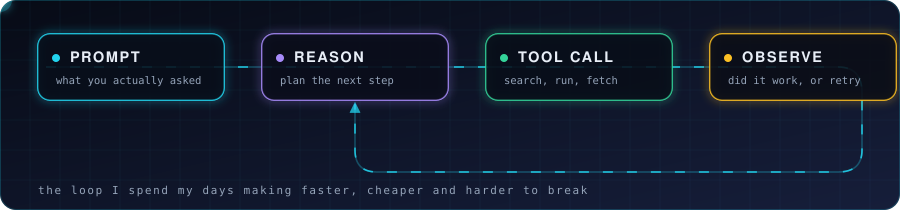

<div align="center">
  
</div>

<div align="center">

[](mailto:ai@liberate-labs.com)
[](#selected-work)

</div>


## Hello

I am an Associate AI Engineer at Liberate Labs. I build LLM agents and the unglamorous
scaffolding around them: the tool layer, the retrieval, the evals that tell you whether
last week's prompt change actually helped or just felt better.

Most of my work is the gap between a demo that works once and a system that works on a
Tuesday afternoon with real data and a user in a hurry.


## The loop I work in

<div align="center">
  
</div>

Every project I touch is some version of this circuit. The interesting engineering is
almost never in the model call. It is in what the tools return, how failures get
observed and what happens on the retry.


## Toolkit

<div align="center">
  
</div>


## Selected work

| Project | What it is | Built with |
|---|---|---|
| **[standup-sync](https://github.com/hamim-liberate-labs/standup-sync)** | A Claude Code plugin that drafts your standup, asks where it goes and posts to ClickUp and Slack as you, not as a bot. Zero runtime dependencies, tested, CI green | `Python` `Claude Code` `Slack API` `ClickUp API` |
| **[assemblyai_exploration](https://github.com/hamim-liberate-labs/assemblyai_exploration)** | Speech-to-text benchmark across five providers in English, Arabic and Bangla, scored on WER and CER rather than vibes | `AssemblyAI` `Groq` `Deepgram` `jiwer` |
| **[browser_agent_experiment](https://github.com/hamim-liberate-labs/browser_agent_experiment)** | A conversational course-discovery agent that drives a real browser, with intent routing and a scraper behind it | `LangGraph` `Playwright` `Groq` |
| **[Liberate-Labs-Assignments](https://github.com/hamim-liberate-labs/Liberate-Labs-Assignments)** | Agent engineering coursework: a customer support graph, an essay writer, computer use and a retrieval Q&A bot | `LangGraph` `LangChain` |


## Currently

```yaml
role:      Associate AI Engineer @ Liberate Labs
building:  agent tooling, retrieval pipelines, evaluation harnesses
learning:  making evals boring enough that people actually run them
opinion:   an agent without observability is a rumour
open_to:   collaboration on agent infrastructure and speech work
```

<div align="center">
  
  <sub><b>Thanks for scrolling.</b> The animations above are hand-written SVG, no third-party image services.</sub>
</div>
